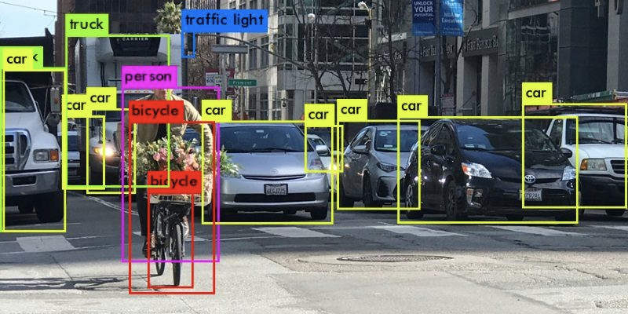

# Thesis project by Sarov Timur
# Object detection with YOLOv4 - WebApp using Streamlit
Object Detection on Microsoft COCO dataset using YOLOv4 Configuration and Weights

Demo :  [](https://https://share.streamlit.io/plorred/coco_app/new/myselfdrive.py)

# Requirements 🏫
```
- opencv-python==4.5.5.62
- pillow>=8.3.1
- numpy>=1.19.2
- opencv-python-headless==4.5.5.62
- streamlit==1.7.0
- streamlit_webrtc>=0.25.0
```


# Built with
<p float="left">
  
   
  
</p>

# COCO Dataset 🍫

| S.No | Sports         | Living   | Things      | Vehicles  | Safety        | Food     | Dining       | Electronics |
|------|----------------|----------|-------------|-----------|---------------|----------|--------------|-------------|
| 1    | frisbee        | bird     | bench       | bicycle   | traffic light | banana   | bottle       | tvmonitor   |
| 2    | skis           | cat      | backpack    | car       | fire hydrant  | apple    | wine glass   | laptop      |
| 3    | snowboard      | dog      | umbrella    | motorbike | stop sign     | sandwich | cup          | mouse       |
| 4    | sports ball    | horse    | handbag     | aeroplane | parking meter | orange   | fork         | remote      |
| 5    | kite           | sheep    | tie         | bus       | ~Nil~         | broccoli | knife        | keyboard    |
| 6    | baseball bat   | cow      | suitcase    | train     | ~Nil~         | carrot   | spoon        | cell phone  |
| 7    | baseball glove | elephant | chair       | truck     | ~Nil~         | hot dog  | bowl         | ~Nil~       |
| 8    | skateboard     | bear     | sofa        | boat      | ~Nil~         | pizza    | microwave    | ~Nil~       |
| 9    | surfboard      | zebra    | pottedplant | ~Nil~     | ~Nil~         | donut    | oven         | ~Nil~       |
| 10   | tennis racket  | giraffe  | bed         | ~Nil~     | ~Nil~         | cake     | toaster      | ~Nil~       |
| 11   | ~Nil~          | person   | diningtable | ~Nil~     | ~Nil~         | ~Nil~    | sink         | ~Nil~       |
| 12   | ~Nil~          | ~Nil~    | toilet      | ~Nil~     | ~Nil~         | ~Nil~    | refrigerator | ~Nil~       |
| 13   | ~Nil~          | ~Nil~    | book        | ~Nil~     | ~Nil~         | ~Nil~    | ~Nil~        | ~Nil~       |
| 14   | ~Nil~          | ~Nil~    | clock       | ~Nil~     | ~Nil~         | ~Nil~    | ~Nil~        | ~Nil~       |
| 15   | ~Nil~          | ~Nil~    | vase        | ~Nil~     | ~Nil~         | ~Nil~    | ~Nil~        | ~Nil~       |
| 16   | ~Nil~          | ~Nil~    | scissors    | ~Nil~     | ~Nil~         | ~Nil~    | ~Nil~        | ~Nil~       |
| 17   | ~Nil~          | ~Nil~    | teddy bear  | ~Nil~     | ~Nil~         | ~Nil~    | ~Nil~        | ~Nil~       |
| 18   | ~Nil~          | ~Nil~    | hair drier  | ~Nil~     | ~Nil~         | ~Nil~    | ~Nil~        | ~Nil~       |
| 19   | ~Nil~          | ~Nil~    | toothbrush  | ~Nil~     | ~Nil~         | ~Nil~    | ~Nil~        | ~Nil~       |

# How to Run this Program using streamlit🏃‍♂️
```
streamlit run myselfdrive.py
```
parameters(default has already been set): 
--cfg Config path
--weights weights_path
--car_images path_to_images(default is data/test)
--random_images path_to_images(default is data/test2)
```
example: streamlit run myselfdrive.py --cfg yolo/yolov4.cfg --weights yolo/tolov4.weights
```
# Reference 🧾
You can read more about [YOLO](https://pjreddie.com/darknet/yolo/)
and more about [streamlit](https://streamlit.io/)

